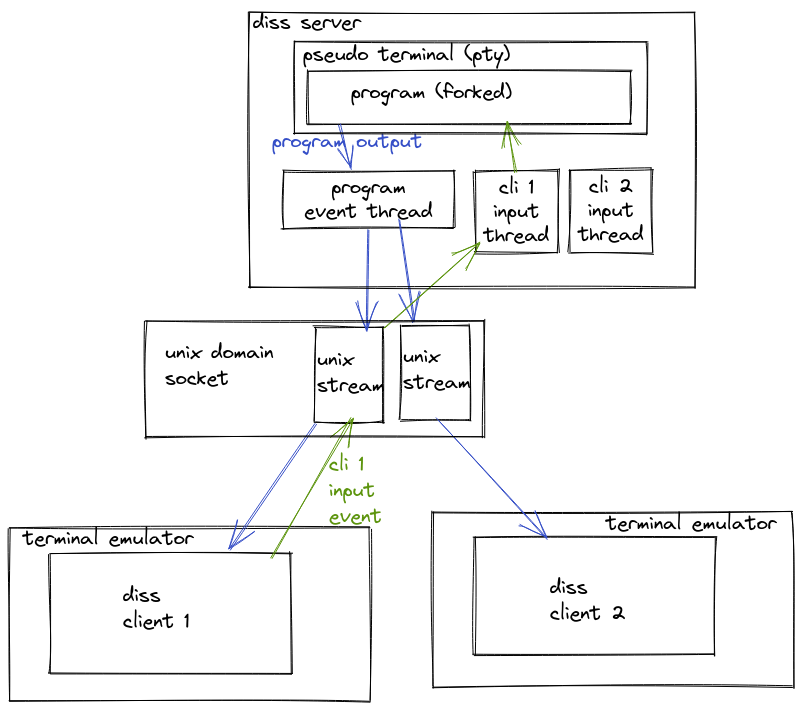

<table>
<tr>
<td>

</td>
<td>
<b>diss</b>ociate (verb):
<pre>
1. (especially in abstract contexts) disconnect or separate.
</pre>
</td>
</tr>
</table>

[](https://discord.gg/F684Y8rYwZ)

## What is diss ?

Diss:

- dissociates a program from current terminal
- is like [dtach](https://github.com/crigler/dtach), [abduco](https://github.com/martanne/abduco) (think [GNU screen](https://www.gnu.org/software/screen/) or [tmux](https://github.com/tmux/tmux) without multiplexing)
- is also a rust crate you can easily integrate

## How do I use diss CLI ?

### installing

1. [install cargo](https://doc.rust-lang.org/cargo/getting-started/installation.html)
2. run `cargo install diss`

### create session (or reatach if already exists), detach with CTRL+g

```
diss -e g -a session-name vim hello
```

### attach to running session

```
diss -e g -a session-name
```

### list running sessions

```
diss -l
```

## projects based on diss

- [vmux](https://github.com/yazgoo/vmux), a vim terminal multiplexer

## How does diss work ?



When you start a diss new diss session, diss will launch a server, which will:

1. create and bind to a unix domain socket (located in `~/.config/diss`)
1. daemonize the process (so it is not a child of current terminal)
1. fork with ptmx / ptms:
1. in the child, launch the program you want to use with a pseudo terminal 
1. start a program event thread waiting for events from the child
1. in the parent, will start waiting for connection from client

Diss will then start a client which will:

1. connect to the server unix domain socket
1. send terminal size to the server
1. send a flush request to the server
1. in a thread, take events from the terminal and forward them via the socket 
1. read server output as raw bytes and print them in the terminal

When a client connect, the server will:

1. add the client unix stream to the program event thread 
1. create a new thread to receive events from the client and forward them to the child
